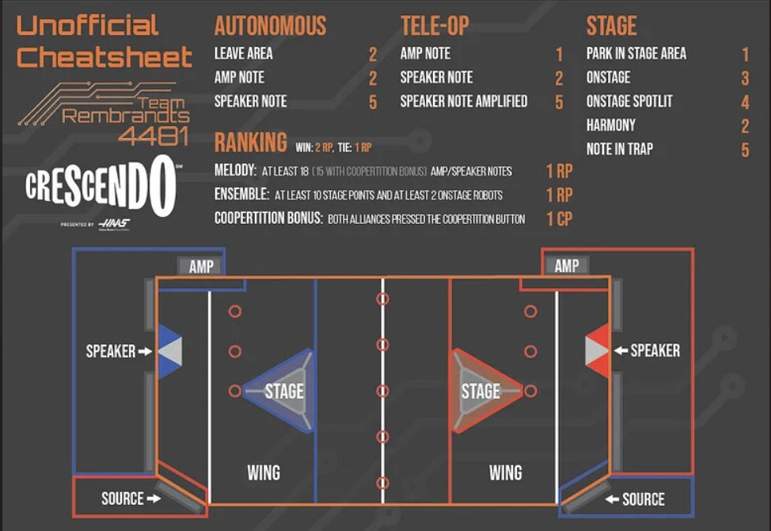

# 2024_Robot

Code for FRC 2067's 2024 Robot for the game [CRESCENDO](https://www.youtube.com/watch?v=9keeDyFxzY4)

[Controller button map](#TODO)

## Useful links:

  * [2024 Game manual](https://firstfrc.blob.core.windows.net/frc2024/Manual/2024GameManual.pdf)
  * [wpilib getting started](https://docs.wpilib.org/en/latest/index.html)
    covers how to [wire](https://docs.wpilib.org/en/latest/docs/zero-to-robot/step-1/how-to-wire-a-robot.html) and [program](https://docs.wpilib.org/en/latest/docs/zero-to-robot/step-2/index.html) a robot

    * [Status Light Quick Reference](https://docs.wpilib.org/en/latest/docs/hardware/hardware-basics/status-lights-ref.html) - something is blinking at you... what does it mean?
  * documentation for software libraries and hardware we'll use:
    * [wpilib javadocs](https://github.wpilib.org/allwpilib/docs/release/java/index.html)
    * [Path Planner](https://pathplanner.dev/home.html)
    * [Choreo](https://sleipnirgroup.github.io/Choreo/usage/editing-paths/)
    * [CTRE TalonFX motor controller code examples](https://github.com/CrossTheRoadElec/Phoenix-Examples-Languages/tree/master/Java%20Talon%20FX%20(Falcon%20500)) ([motion magic](https://github.com/CrossTheRoadElec/Phoenix-Examples-Languages/tree/master/Java%20Talon%20FX%20(Falcon%20500)/MotionMagic), [velocity](https://github.com/CrossTheRoadElec/Phoenix-Examples-Languages/tree/master/Java%20Talon%20FX%20(Falcon%20500)/VelocityClosedLoop) control)
      * [Closed loop primer](https://v5.docs.ctr-electronics.com/en/stable/ch16_ClosedLoop.html)
      * [MotionMagic parameters / Pheonix Tuner](https://youtu.be/1b0BAV2jBd8) video
      * [CTRE Documentation](https://v5.docs.ctr-electronics.com/en/stable/index.html)
    * [REV SPARK-MAX motor controller code examples](https://github.com/REVrobotics/SPARK-MAX-Examples/tree/master/Java) ([position](https://github.com/REVrobotics/SPARK-MAX-Examples/tree/master/Java/Position%20Closed%20Loop%20Control) control, [velocity](https://github.com/REVrobotics/SPARK-MAX-Examples/tree/master/Java/Velocity%20Closed%20Loop%20Control) control)
      * [REV SPARK-MAX documentation](https://docs.revrobotics.com/sparkmax/)
    * [Photonlib](https://docs.photonvision.org/en/latest/docs/programming/photonlib/adding-vendordep.html)

## Robot Subsystem Descriptions

todo: add picture of robot cad

### Drivetrain

The motors that move the robot chassis around the field.

  * Motors
    * 4x - Falcon500 swere modules (2 Falcon500s per module) 
  * Sensors
    * Pigeon IMU for measuring robot heading and pitch

### Intake
Picks up game pieces off the ground. Hands them off to the hopper

  * Motors
    * `tbd`x Falcon 500
      * Velocity closed loop control

  * Sensors
    * `tbd`

### Shooter
Motors at the front of the shooter assembly that allow game pieces to be fired out of the robot.

  * Motors
    * `tbd`x - Falcon 500 
      * Velocity closed loop control

### Hopper
Brings in game pieces from the intake. Stores them until the shooter is ready to be fired.

  * Motors
    * `tbd`x - Falcon 500
      * `tbd` - Velocity closed loop control 

### Linear Lift

Moves the shooter assembly vertically to differnt heights

  * Motors
    * `tbd`x - Falcon 500
      * Motion Magic - position closed loop control

### Shoulder

Rotates the shooter assembly to change pitch angle

  * Motors
    * `tbd`x - Falcon 500
      * Motion Magic - position closed loop control

## Getting Started

### Software installation

* Download and Install the [latest WPIlib 2024 release](https://github.com/wpilibsuite/allwpilib/releases)
  
  * If you're on Windows, download the latest `.iso` file (e.g. `WPILib_Windows-2024.1.1.iso`).
  * While connected to the internet, open the ISO
    * run the `WPILibInstaller.exe` file
    * follow the on-screen instructions, to install vscode for your user

* Other tools you need & should install:
  * [FRC Game tools](https://www.ni.com/en-us/support/downloads/drivers/download.frc-game-tools.html) 
    * You need this to control a robot (includes the driverstation application)
    * You can skip license entry / activation for the NI Vision component we won't 
    * Open the driverstation and enter our team number (2067) from the `Setup` Tab on the left (gear) 
  * [Radio configuration utility](https://firstfrc.blob.core.windows.net/frc2023/Radio/FRC_Radio_Configuration_23_0_2.zip)
  * [Phoenix Framework Installer](https://store.ctr-electronics.com/software/)
    * Software libraries for CTRE devices
    * Includes phoenix tuner for configuring/updating firmware on CTRE devices 
  * [Phoenix Tuner X](https://v6.docs.ctr-electronics.com/en/stable/docs/tuner/index.html)
    * install from [windows](https://apps.microsoft.com/detail/9NVV4PWDW27Z?hl=en-us&gl=US) 
      or [android](https://play.google.com/store/apps/details?id=com.ctre.phoenix_tuner) app store
  * [Rev Hardware Client](https://docs.revrobotics.com/rev-hardware-client/)
    For upgrading firmware on REV Robitics devices

    * After installation, perform an update to download device firmwares so you'll have them avaialable later if you're not online (e.g. at a competition)
 
* Install git bash

  * [Download the appropriate installer](https://git-scm.com/downloads) for your OS
  * Install following onscreen instructions
  * `TODO` any additional setup steps - dry run on fresh install 

* Create an account at `github.com`, you should have recieved an invite at the email you used to register for slack.

## Clone this repo to your desktop
The following steps will authorize vscode to access your github account through OAuth.
This is in place of setting up ssh keys. If you'd rather do that, feel free to do so.     
Similar steps to what we're doing [are covered here](https://adamtheautomator.com/visual-studio-code-github-setup/#Cloning_a_GitHub_Repository) if the below isn't clear enough.

  * Open the `2024 WPILib VS Code` link (on your desktop?)
  * Click the `Source Control` tab on the right ( Ctrl+Shift+G )
  * Click the `Clone Repository` button 
    * This will open the `Command Palette` at the top middle.   
      You will come to know this VS Code feature well...
    * Click the `Clone from GitHub` option
    * Follow the on-screen steps to authorize vscode to access your github account

  * Choose the `applepi-2067/2024_Robot` project

  * Choose a directory to clone the project into that you will remember (e.g. Documents\FRC\)
    a new subdirectory for the project will be created

  * The first time the project opens it should start downloading dependencies and building the code. 
    You should see the status of the build process listed at the bottom `Terminal` panel in vscode
    * If the build fails, you may not have completed the installation of the Phoenix Framework Installer (above).

### Using vscode

`TODO: update for 2024`

* Most actions in vscode can be performed through the [Command Palette](https://docs.wpilib.org/en/stable/docs/software/vscode-overview/vscode-basics.html#command-palette)
  * Open with ( Ctrl + Shift + P ) or `View` > `Command Palette`

* Some example commands you can run from the `Command Palette`
  * `Build Robot Code` - Compiles the code in the project
  * `Deploy Robot Code` - Compiles, deploys, and runs the code on the roborio (you need to be connected)
  * `Simulate Robot Code` - Compiles, deploys and runs the code in simulation.
    * You need to have the driverstation or simulated driverstation running to get into Auto or Teleoperated mode.
    * Requires simulation models to be implemented for verification of some functionality, but with a little work up front
      this can be a great way to test your code when you don't have access to robot hardware.
  * Complete list of commands [here](https://docs.wpilib.org/en/stable/docs/software/vscode-overview/wpilib-commands-vscode.html)

### Using git

  * https://docs.wpilib.org/en/stable/docs/software/basic-programming/git-getting-started.html

  `TODO`
  
